# FTP - Configuración, cliente gráfico, instalación de un servidor vsftpd y acceso seguro

## Paso 1. Configuración de partida y DNS

En el archivo `irene.test.dns` he añadido los siguientes registros:

`ns.irene.test. IN A 192.168.56.101` para asociar el nombre de dominio `ns.irene.test` a la dirección IP del servidor DNS.

`ftp.irene.test. IN CNAME ns.irene.test.` para asignar al nombre de dominio `ftp.irene.test` un alias que apunte a la misma IP que el servidor DNS.

He modificado la IP de la máquina virtual de `192.168.56.10` a la propuesta en el enunciado de la práctica, que sería `192.168.56.101`. 
Además, he modificado sus respectivas referencias dentro de los archivos del servidor DNS.

También he modificado la configuración de mi máquina anfitriona para que el DNS primario apunte a la dirección IP de la máquina virtual, que es donde se aloja el servidor DNS. 
Comprobé que este cambio fuera válido utilizando la herramienta `nslookup` seguido del nombre de dominio y la IP del servidor DNS.

## Paso 2. Cliente FTP Gráfico

Para esta parte, he decidido instalar el cliente WinSCP, y para comprobar que todo funcionaba bien establecí una conexión anónima `anonymous`, sin contraseña, e intenté bajarme y subir un archivo.

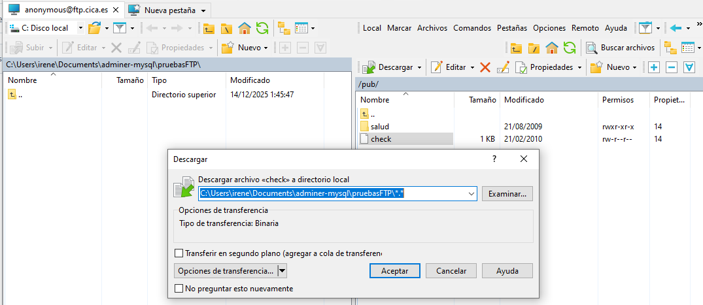

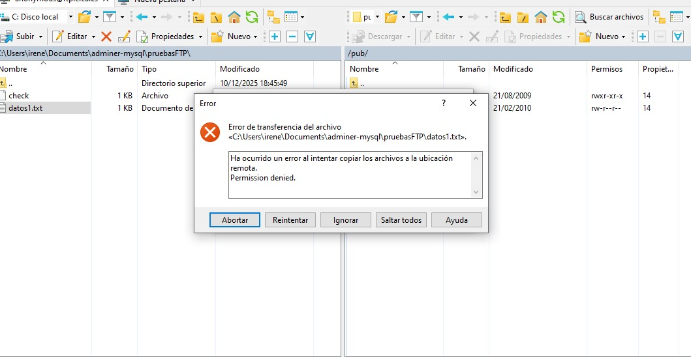

Como es anónimo, solo puede bajarse archivos.

## Paso 3. Instalación y configuración vsftpd

Primero instalamos el servidor vsftpd utilizando el gestor de paquetes del sistema.

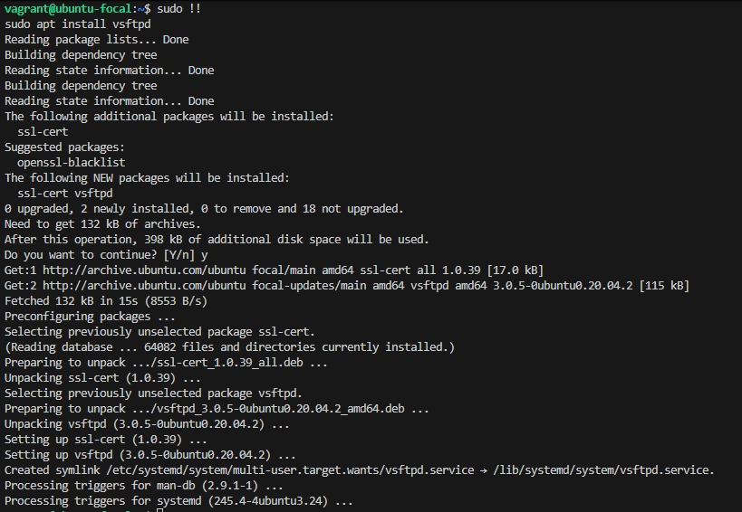

Una vez instalado, se comprueba que el usuario `ftp` ha sido creado automáticamente y que su directorio es `/srv/ftp`.

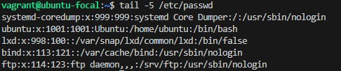

Tras esto, compruebo a qué grupo está asociado.

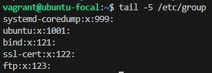

Verifico la existencia del directorio `/srv/ftp` y que sus permisos sean correctos.

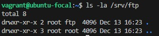

Para conocer qué usuarios no pueden acceder al servicio FTP, muestro la lista del archivo `/etc/ftpusers`.

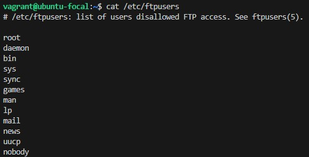

Compruebo que el servicio vsftpd está iniciado y en ejecución.

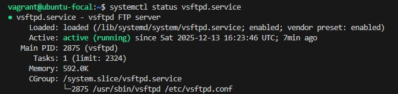

Compruebo que está escuchando el puerto 21, siendo el estándar para este servicio.


Por si ocurre cualquier cosa, se hace una copia de seguridad del archivo de configuración principal.


A continuación, se crean los usuarios locales que podrán utilizar el servicio FTP.

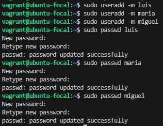

Creo los ficheros de prueba que posteriormente utilizaré.


Se modifica el archivo de configuración según los requisitos indicados, aunque antes hay que eliminar los comentarios originales y los sustituyo por comentarios propios para explicar cada directiva:

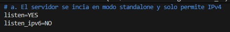

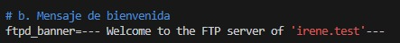

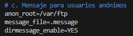

El mensaje definido con `ftpd_banner` es una variable global y solo puede contener un único mensaje. Si se usara para mostrar también el mensaje de los usuarios anónimos, se sobrescribiría al mensaje general y se mostraría a todos los usuarios. Por ello, he utilizado un archivo .message para mostrar un mensaje específico únicamente a los usuarios anónimos, manteniendo separado el mensaje general del servidor.


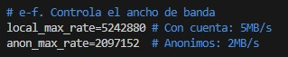

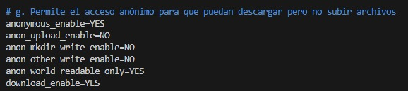

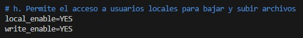

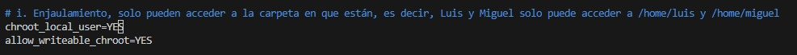


En el archivo `vsftpd.chroot_list`, añado a los usuarios que van a ser libres, es decir, que van a poder moverse entre carpetas y que no van a estar únicamente en `/home/<name>`. En este caso, solo tengo que añadir al usuario `maria`.


Tras aplicar los anteriores cambios, reinicio el servidor FTP, compruebo que está activo y que sigue escuchando por el puerto 21/TCP.

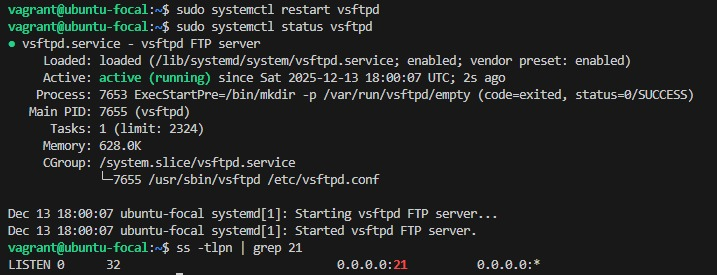

Al comprobar que todo está en order, realizo una prueba con cada usuario distinto para asegurarme:

Usuario `anonymous`

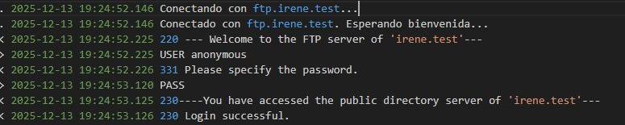

Usuario `maria`

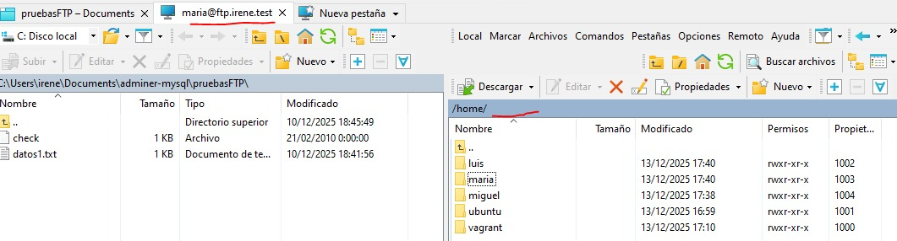

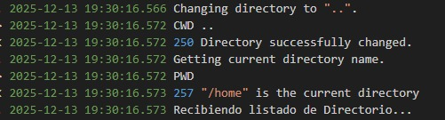

Usuario `luis`

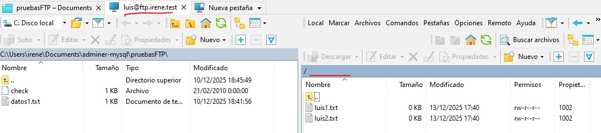

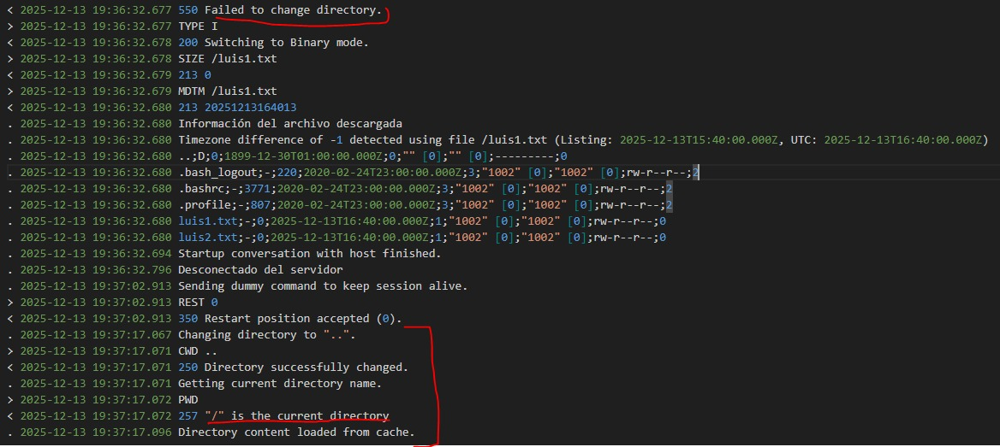

## Paso 4. Servidor vsftpd seguro

En este apartado, se configura el servicio FTP para permitir conexiones seguras mediante **FTPS** utilizando un certificado de servidor. Además, se restringe el uso de conexiones cifradas a anónimos.

Primero, se genera un certificado SSL/TLS que será utilizado por el servidor FTP con el siguiente comando:
```
sudo openssl req -x509 -nodes -days 365 -newkey rsa:2048 -keyout /etc/ssl/certs/irene.test.pem -out /etc/ssl/certs/irene.test.pem
```

Permisos que necesita:
```
sudo chmod 600 /etc/ssl/certs/irene.test.pem
sudo chown root:root /etc/ssl/certs/irene.test.pem
```

Se modifica el archivo `/etc/vdftpd.conf` para habilitar las conexiones seguras mediante SSL/TLS. Tras esto, se reinicia el servidor, se comprueba que esté activo el servicio y que sigue escuchando por el puerto 21.

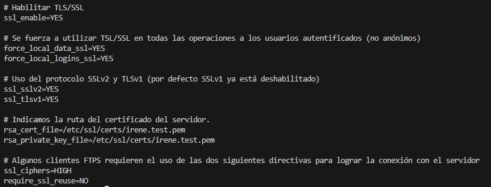

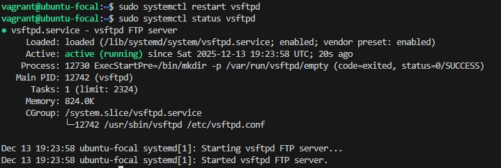


Se comprueba desde el usuario de `luis` si se ha autenticado bien:

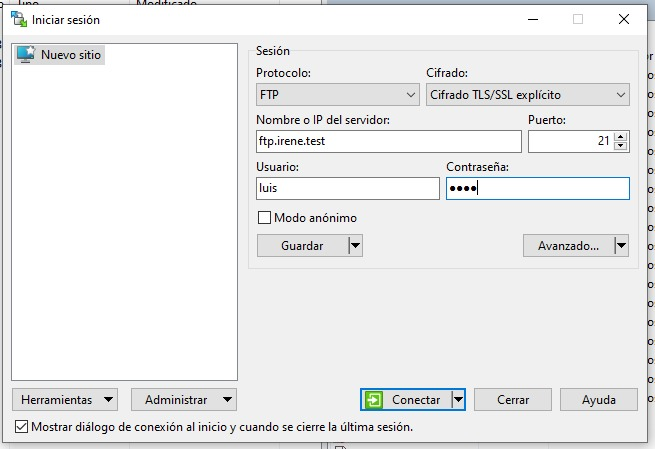

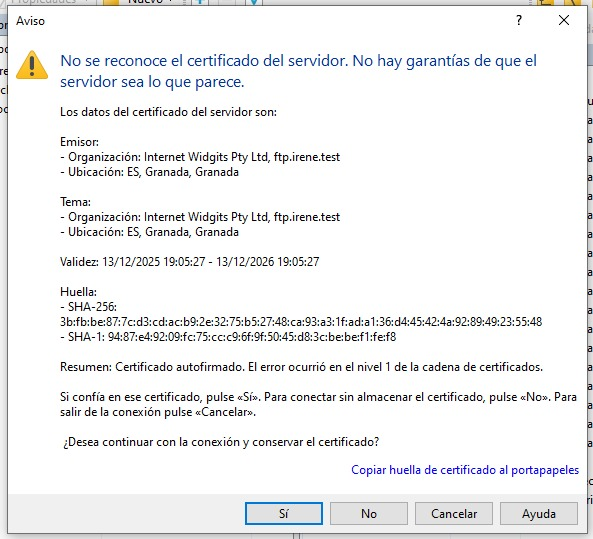

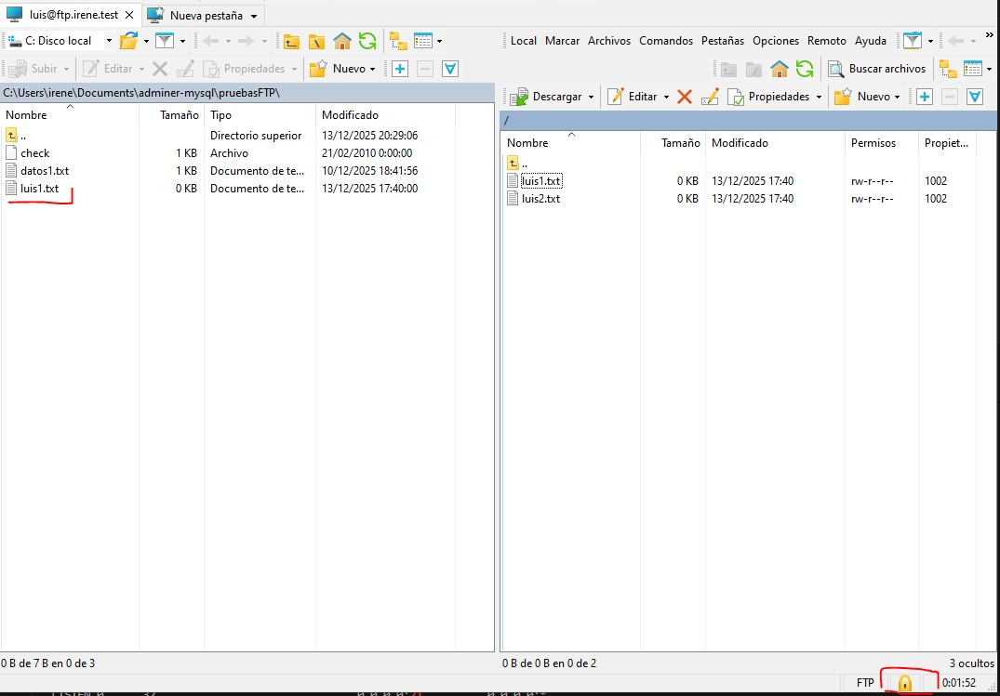

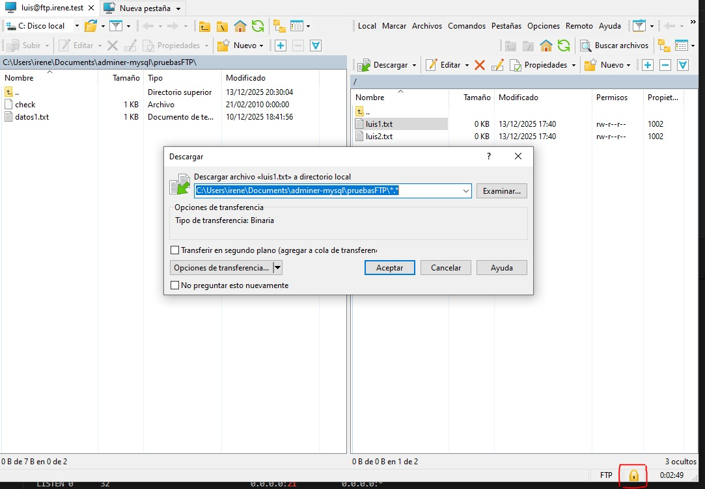

Por otro lado, si lo hacemos con `anonymous`:

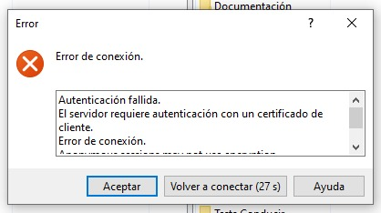

Y por último con `maria`:

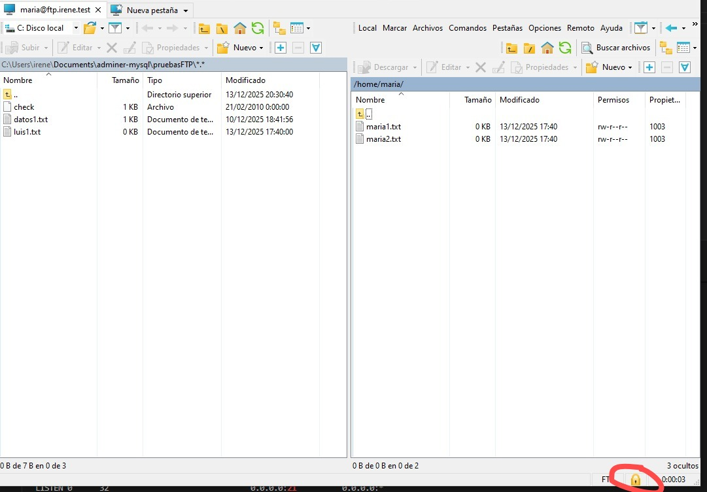


